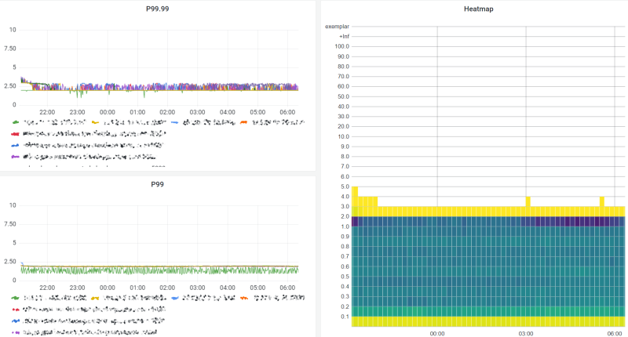

# cdn-performance-test-kit

Simulate media stream delivery through a CDN and collect latency &amp; availability metrics.

# Concept

**MediaServer** is a media server simulator, which publishes N clones of a media stream to an Azure Blob Storage Account. **MediaClient** is a media player simulator, which "plays" (downloads) all these media streams in real time. Both apps record detailed metrics about performance and availability.

MediaServer takes one real media stream as input and uploads N clones of this media stream. Each of the media streams is independent and accessible on a unique URL.

Place the CDN you want to analyze between the Azure Blob Storage Account and the MediaClient.

# Prerequisites

All:

* .NET 6
* Visual Studio 2022

Media server:

* Install [ffmpeg-git-essentials](https://www.gyan.dev/ffmpeg/builds/) and add the `bin` directory to the `PATH` environment variable. It should be possible to execute `ffmpeg.exe` from a terminal.

# Usage

Prepare your Azure Blob Storage Account:

* Premium SKU is recommended.
* Enable CORS on the Azure Blob Storage Account if you want to also play back the content using a player like hls.js (the media streams are real and playable).
* Enable public access to blobs.

Start MediaServer:

1. Build the solution in Release mode.
1. Start MediaServer from a PowerShell terminal: `.\MediaServer.exe --media-stream-count=800 --media-streams-per-second=10 --connection-string="<your Azure Storage connection string here>"`
    * Specifying the start index allows you to generate media streams with non-overlapping indexes from multiple instances of MediaServer, if you wish.
1. Open a second PowerShell terminal and execute `Scripts/Start-HlsStream.ps1` to start generating the input media stream.
1. Open http://localhost:5005/metrics. You should see a text file with various status indicators.
1. Wait for the `mlms_media_streams_connected` line in this text file to update to your desired media stream count. The startup is deliberately slow to avoid a sudden initial spike causing Azure Storage throttling.

Start one or more MediaClients:

1. Build the solution in Release mode.
1. Start MediaClient from a PowerShell terminal: `.\MediaClient.exe --media-stream-count=800 --url-pattern="https://<your CDN hostname>/files/{0:D5}/hls/{1}"`
1. Open http://localhost:5010/metrics. You should see a text file with various status indicators.

Finally, set up Prometheus metric capturing on the metrics endpoints for at least MediaClient instances. How to set up and Prometheus is out of scope for this guide. You can obtain the data on the metrics URLs listed above.

Once both MediaServer and MediaClient instances are started, leave it running for at least 12-24 hours to collect a good data set. MediaClient will record timestamps and tracing metadata for particularily problematic requests to `outdated-content.log` if it seems some suspiciously old files being returned to it.

# Analysis

Useful Prometheus queries:

99.99th percentile latency over the last 12 hours of data: `histogram_quantile(0.9999, sum by (le, instance) (rate(mlmc_manifest_e2e_latency_seconds_bucket[12h])))`

There is a [Grafana dashboard](CDN analysis.json) included in this repo for convenient analysis. Setup and usage of Grafana is out of scope for this guide.